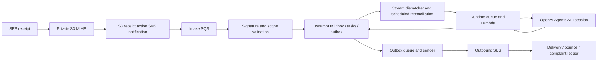

# Initial operating foundation

The first implemented capability is `website.brief.analyze`: structured goals, audience, proposed pages, missing inputs, assumptions, acceptance criteria, and research citations. Website generation, autonomous repository engineering, the Teco pilot, and external A2A compliance remain future work. Deployment and verification status are recorded separately in [release verification](release-verification.md).

## Architecture

Five TypeScript CDK stacks separate website delivery, CI identity, email/state, runtime, and controls. Shared Route 53, bootstrap, and GitHub OIDC resources are imported. Lambda and CI use Node.js 22 in `us-east-1`.

The test recipient stores messages under `controlled/` without SNS notification or intake, so replies cannot recursively create tasks. Authentication uses the signed JSON MIME part; ordinary email headers do not grant authority. A partner key grants specific projects, actions, destinations, expiry, and research access. Unverified mail receives no reply.

Intake atomically records inbox identity, replay nonce, daily admission, task, and acceptance outbox. DynamoDB streams publish work; an independent one-minute watchdog recovers missed publication. Workers use expiring leases. Task submission intent and idempotency key precede the API call; ambiguous creation reconciles session metadata or blocks with its reservation held. Tool outcomes are saved by task/call ID. An interrupted paid research call blocks rather than repeating an uncertain charge.

The Agents API uses `environment.type: none`, `gpt-6-luna`, and disabled delegation. Only project input retrieval and explicitly granted public-topic research are exposed. Research queries must equal approved public topics and reject secret/private markers. No shell, email, GitHub, deployment, or permission tools are available to the model. A completed provider turn and schema-valid result are both required. Saved items support recovery. Session deletion follows durable result capture and is retried independently.

SES acceptance and delivery are separate states. A timeout or interrupted send becomes `delivery_unknown`, with no automatic resend. This system deduplicates processing and does not promise exactly-once email delivery.

## Limits and retention

Defaults are defined in [protocol implementation](../services/src/protocol.ts): 1 MiB raw mail; 128 KiB protocol part; two UTF-8 `.txt` attachments of 128 KiB each; two active tasks; ten accepted submissions per UTC day; five-minute deadline; two research calls and six total application calls; 32,000 input and 8,000 output observed session tokens. The brief and attachments together must fit the initial runtime input allowance.

A monthly application ledger starts with $10 and reserves $1 atomically before each execution. Research search fees and observed usage are charged to that reservation. Unknown usage retains the reservation for owner reconciliation. Managed-agent counters and cancellation may lag, so monitored token/dollar thresholds are allowances rather than hard billing caps. AWS budgets notify and do not stop spending. The $25 overall target and dated estimates are in [costs](costs.md).

Content and results expire after 30 days; rejected raw messages after seven days; redacted audit/replay records after 90 days; DLQs after 14 days. S3 lifecycle and DynamoDB TTL deletion are asynchronous. One-day DynamoDB point-in-time recovery can retain recently deleted state. Partner registry and switches remain until owner removal. Private release snapshots remain for rollback. Provider-side storage is separate: see [OpenAI data controls](https://developers.openai.com/api/docs/guides/your-data). Session deletion does not override applicable abuse-monitoring retention.

## GitHub authority

The private repository-only App mints fixed installation-token profiles through separate Lambda brokers. Development has contents/pull requests write and Actions read; policy has checks write and contents/pull requests read. Neither grants administration or workflow modification. The brief runtime has no broker invocation or App secret access.

A deployed Lambda verifies webhook signatures and independently fetches every changed path, rename origin, current PR head, and reviews. Protected paths require Carlos's current-head approval. Labels and agent-authored approval text confer no authority. Branch protection must bind `a2aviary-policy` to the App, require CI, deny force pushes/deletion, and give the App no bypass. Autonomous merging stays disabled until these controls are verified.
